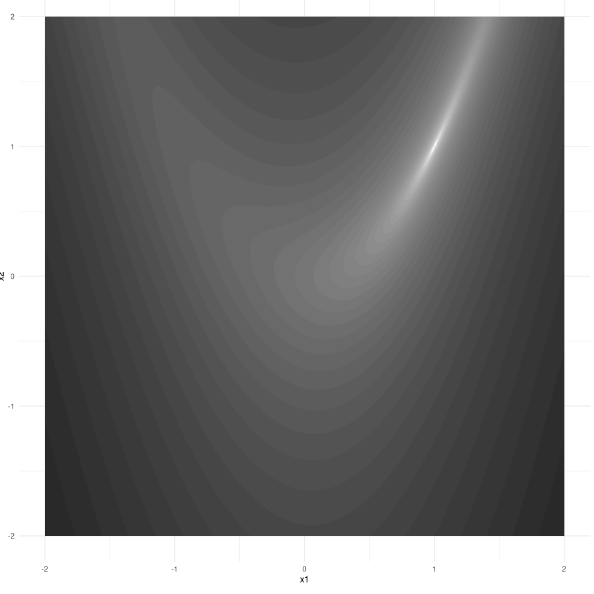

# Function minimization with autograd

**Learning objectives:**

-   Apply concepts learned in the previous two chapters

## An Optimization Classic {.unnumbered}

**Example**:

*Rosenbrock function*: A function of two variables with minimum at $(a,a^2)$, which lies inside a narrow valley:

$$
(a- x_1)^2 + b(x_2 - x_1^2)^2
$$

<center>[](https://skeydan.github.io/Deep-Learning-and-Scientific-Computing-with-R-torch/optim_1.html#an-optimization-classic)</center>

Below we set values for `a` and `b` and define the `rosenbrock` function. We expect the minimum of the function to be at $(1,1)$ (when `a=1`).

```{r}
a <- 1
b <- 5

rosenbrock <- function(x){
  x1 <- x[1]
  x2 <- x[2]
  (a - x1)^2 + b * (x2 - x1^2)^2
}
```

## Minimization from Scratch {.unnumbered}

**Goal**: Starting from a point `(x1, x2)` find minimum of the Rosenbrock function.

**Approach**: Use the function's gradient.

**Setup**:

```{r}
library(torch)

lr <- 0.01 # learning rate
num_interations <- 1000

x <- torch_tensor(c(-1, 1), requires_grad = TRUE)
```

`x` is the parameter with respect to which we want to compute the function's derivative. Thus, we set `requires_grad = TRUE`. We have arbitrarily chosen `x = (-1, 1)` as a starting point of our search.

Next we perform the minimization. For each iteration we will:

1.  Compute the value of the `rosenbrock` function at the current value of `x`.

2.  Compute the gradient at `x` (i.e. direction of steepest ascent).

3.  Take a step of size `lr` in the (negative) direction of the gradient.

4.  Repeat.

A few things to point out about the code below:

-   We use the `with_no_grad()` function. Reason: Because we set `requires_grad = TRUE` in the definition of `x`, torch will include all operations on `x` (including this one) in the derivative calculation, which we don't want.
-   Recall from [Chapter 3](https://r4ds.github.io/bookclub-torch/operations-on-tensors.html) that `x$sub_()` (*with an underscore*) will modify the value of `x`. Similarly, `x$grad$zero_()` will also modify `x`.
-   We use `x$grad$zero_()` to zero out the `grad` field of `x`. By default, torch accumulates gradients.

```{r}
for(i in 1:num_interations){
  if(i %% 200 == 0) cat("Iteration: ", i, "\n")
  
  # Compute value of function:
  value <- rosenbrock(x)
  if(i %% 200 == 0) cat("Value is: ", as.numeric(value), "\n")
  
  # Compute the gradient 
  value$backward()
  if(i %% 200 == 0) cat("Gradient is: ", as.matrix(x$grad), "\n\n")
  
  with_no_grad({
   x$sub_(lr * x$grad) # Take a step of size lr in the (negative) direction of the gradient
   x$grad$zero_() # Zero out grad field of x.
  })
}

```

Let's check the value of `x`:

```{r}
x
```

It's close to (1,1) (the true minimum)!

> Exercise: What kind of difference does the learning rate make? Try `lr=0.001` and `lr=0.1`, respectively.

## Meeting Videos {.unnumbered}

### Cohort 1 {.unnumbered}

`r knitr::include_url("https://www.youtube.com/embed/URL")`

<details>

<summary>Meeting chat log</summary>

```         
LOG
```

</details>
